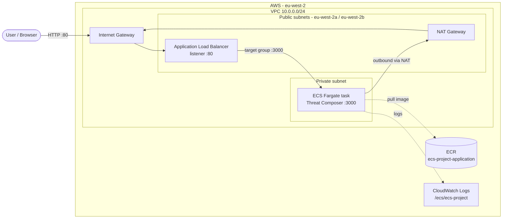

# ECS Project: Threat Composer on AWS Fargate

This project deploys [Threat Composer](https://github.com/awslabs/threat-composer), a React threat-modelling app, to **AWS ECS Fargate**. The container image is built with Docker and stored in **Amazon ECR**. All the infrastructure is defined in **Terraform**, and the app is served through an **Application Load Balancer**.

The project takes the app from a manual AWS setup (ClickOps) to infrastructure as code, and then to automated deployments.

---

## Project status

| Stage | Status |
|---|---|
| 1. Application setup | ✅ Done |
| 2. Containerisation (multi-stage Dockerfile, non-root user) | ✅ Done |
| 3. Image registry (ECR) | ✅ Done |
| 4. ClickOps deployment | ✅ Done |
| 5. Terraform: VPC, ALB, ECR, ECS | ✅ Done (app reachable through the ALB over HTTP) |
| 5. Terraform: ACM + Route 53 | 🚧 In progress |
| 6. CI/CD with GitHub Actions (OIDC) | ⏳ Planned |
| 7. HTTPS on `tm.<domain>` | ⏳ Planned |

---

## Architecture



### How a request travels

```
Browser ──:80──► ALB (public subnets) ──:3000──► ECS task (private subnet)
```

1. The **ALB** sits in two public subnets in different Availability Zones and accepts HTTP on port 80 from the internet.
2. The **listener** forwards each request to a **target group** on port 3000.
3. The **ECS Fargate task** runs in a **private subnet** with no public IP. Its security group only accepts port 3000 traffic, so it can't be reached directly from the internet.
4. The task reaches out through the **NAT gateway** to pull its image from **ECR** and send logs to **CloudWatch**.

---

## Tech stack

| Area | Tools |
|---|---|
| App | React (Threat Composer), served with `serve` |
| Container | Docker (multi-stage build, `node:25-alpine`) |
| Registry | Amazon ECR |
| Compute | Amazon ECS on Fargate |
| Networking | VPC, public and private subnets, Internet Gateway, NAT Gateway, ALB |
| IaC | Terraform (AWS provider 6.x), split into modules |
| Logging | Amazon CloudWatch Logs |

---

## Repository structure

```
.
├─ app/                      # Threat Composer app source
│  ├─ Dockerfile             # Multi-stage build: builder > runtime
│  ├─ .dockerignore
│  └─ src/ ...
├─ infra/                    # Terraform
│  ├─ main.tf                # Connects the modules together
│  ├─ variables.tf
│  ├─ outputs.tf
│  ├─ provider.tf            # AWS provider (eu-west-2)
│  ├─ terraform.tfvars       # CIDR ranges, ECR repository name
│  └─ modules/
│     ├─ vpc/                # VPC, subnets, IGW, NAT, route tables
│     ├─ alb/                # ALB, security group, target group, listener
│     ├─ ecr/                # ECR repository
│     ├─ ecs/                # Cluster, task definition, service, IAM, logs
│     └─ acm/                # Certificate + Route 53 (in progress)
├─ .gitignore
└─ README.md
```

---

## Containerisation

The [Dockerfile](app/Dockerfile) uses a **multi-stage build**:

- **Builder stage:** installs dependencies with `yarn` and runs `yarn build` to produce the static React build.
- **Runtime stage:** a fresh `node:25-alpine` image that receives only the `build/` folder and serves it with `serve`. The source code and `node_modules` stay behind in the builder stage, which keeps the image small.
- Runs as a **non-root user** (`appuser`).
- Listens on **port 3000**.

---

## Terraform modules

Root [infra/main.tf](infra/main.tf) calls each module and passes outputs from one module into the next, e.g. the VPC's subnet IDs go into the ALB and ECS.

### `vpc`
- VPC `10.0.0.0/24`
- Two **public subnets** in `eu-west-2a` and `eu-west-2b` (an ALB needs two Availability Zones)
- One **private subnet** for the ECS tasks
- Internet Gateway, NAT Gateway (with an Elastic IP), and public and private route tables

### `alb`
- Internet-facing **Application Load Balancer** across both public subnets
- **Security group:** inbound port 80 from anywhere, outbound port 3000 to the VPC only
- **Target group** on port 3000 with `target_type = "ip"` (required for Fargate) and a health check on `/`
- **HTTP listener** on port 80 that forwards to the target group

### `ecr`
- Private ECR repository with **scan on push** enabled

### `ecs`
- **ECS cluster** and **Fargate service** (with a deployment circuit breaker that rolls back automatically)
- **Task definition:** 0.25 vCPU / 512 MB, `awsvpc` networking, container port 3000
- **IAM task execution role** with `AmazonECSTaskExecutionRolePolicy`, which lets ECS pull from ECR and write logs
- **Task security group:** inbound port 3000 only, outbound to anywhere (through the NAT gateway)
- **CloudWatch log group** `/ecs/ecs-project` with 7-day retention

---

## Run it locally

```bash
cd app
docker build -t threat-composer .
docker run -p 3000:3000 threat-composer
```

Then open <http://localhost:3000>.

---

## Deploy to AWS

### Prerequisites
- AWS CLI, configured with an IAM user that can manage VPC, EC2, ELB, ECR, ECS, IAM and CloudWatch Logs
- Terraform 1.x
- Docker

### 1. Create the ECR repository first
The ECS service needs the image to exist before it starts, so create only the repository first:
```bash
cd infra
terraform init
terraform apply -target=module.ecr
```

### 2. Build and push the image
```bash
cd ../app
aws ecr get-login-password --region eu-west-2 | docker login --username AWS --password-stdin <account-id>.dkr.ecr.eu-west-2.amazonaws.com
docker build -t <account-id>.dkr.ecr.eu-west-2.amazonaws.com/ecs-project-application:latest .
docker push <account-id>.dkr.ecr.eu-west-2.amazonaws.com/ecs-project-application:latest
```

### 3. Deploy everything else
```bash
cd ../infra
terraform apply
```

After 2–3 minutes, the ECS service reaches a steady state and the target becomes healthy. You can find the app's address in **EC2 → Load Balancers → `my-alb` → DNS name**.

### 4. Tear it down
The NAT gateway and ALB are charged by the hour. To destroy everything except ECR (so the image doesn't need pushing again):
```bash
terraform destroy -target=module.ecs -target=module.alb -target=module.vpc
```

---

## Screenshots

_To be added:_
- Container running locally
- Image in ECR
- ECS service running with a healthy target
- App live on `https://tm.<domain>`
- Successful GitHub Actions pipeline run

---

## Roadmap

- [ ] **ACM certificate** for `tm.<domain>`, validated through DNS in Route 53
- [ ] **Route 53 alias record** pointing `tm.<domain>` at the ALB (subdomain delegated from Cloudflare)
- [ ] **HTTPS listener** on 443, with HTTP redirected to HTTPS
- [ ] **`/health` endpoint** returning `{"status":"ok"}`
- [ ] **Remote Terraform state** in S3
- [ ] **GitHub Actions**: build and push the image (tagged with the commit SHA), Terraform plan/apply, post-deploy health check, with **OIDC** instead of stored AWS keys
- [ ] `terraform fmt`, `validate` and `tflint` in CI

---

## Useful links

- [Terraform AWS Provider](https://registry.terraform.io/providers/hashicorp/aws/latest/docs)
- [Amazon ECS Developer Guide](https://docs.aws.amazon.com/AmazonECS/latest/developerguide/Welcome.html)
- [Threat Composer](https://github.com/awslabs/threat-composer)
