# Build Log: From the Restart to a Working Deployment

This log covers the project from the point where I restarted with the **Threat Composer** app. It goes through containerising it, deploying it by hand in the AWS console (ClickOps), and moving to Terraform. Each section shows the screenshot from the time, what happened, and what was actually going on underneath.

> Earlier attempts used a different app (IT-Tools, built with pnpm). I dropped it after repeated dependency and pnpm problems and started again with Threat Composer, in my own repository.

---

## 1. The first Threat Composer Dockerfile

```dockerfile
# Node 20+ so the packages and dependencies are compatible
FROM node:25-alpine AS builder
# Work from /app. Before, I was working in /app without the source code being there.
WORKDIR /app
COPY package.json yarn.lock
COPY . .
# Install everything in package.json (creates node_modules)
RUN yarn install
# Run the build script: outputs static HTML, JS and CSS into /app/build
RUN yarn build

FROM node:25-alpine
WORKDIR /app
COPY --from=builder /app /app
# Documents the port the app listens on
EXPOSE 3000
# Install the static file server
RUN yarn global add serve
# Start the server on the build folder
CMD [ "serve", "-s", "build" ]
```

**What worked:**
- `node:25-alpine` instead of `node:19`, because newer packages need a newer Node version.
- Setting `WORKDIR /app` **before** copying, so the source code is actually in the folder I'm working in.
- A two-stage build: stage 1 installs and builds, stage 2 runs. `yarn build` turns the React app into plain static files in `/app/build`, which is all the app needs to run.

**Two problems I found later:**
1. **`COPY package.json yarn.lock` has no destination.** With two arguments, Docker treats the last one as the destination, so this copied `package.json` into a file named `yarn.lock`. It went unnoticed only because `COPY . .` on the next line copies everything anyway. The correct form is `COPY package.json yarn.lock ./`.
2. **`COPY --from=builder /app /app` copies everything**, including `node_modules` (hundreds of MB the running app never uses). This caused the 1.56 GB image in [section 4](#4-rpc-error-eof-and-the-156-gb-image).

`COPY . .` copies from the **build context**: the folder `docker build` is run in (`app/`), minus anything listed in `.dockerignore`.

---

## 2. Running it locally

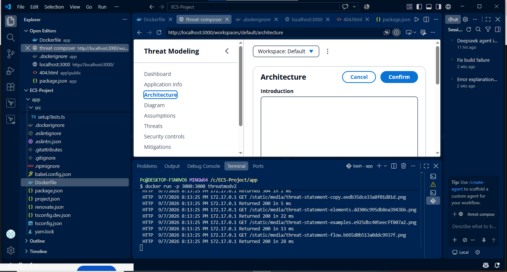

```bash
docker build -t threatmod .
docker run -p 3000:3000 threatmod
```

The app loaded at `localhost:3000`, and the terminal shows `serve` handling requests:
- `Returned 200`: the file was sent.
- `Returned 304`: *Not Modified*. The browser already had that file cached, so nothing was sent again.
- `172.17.0.1` is Docker's bridge network gateway, meaning the request came from my laptop through Docker's network.

**Port mapping:** `-p HOST:CONTAINER` maps a port on my laptop to a port inside the container. `serve` listens on **3000** inside the container, so the mapping must end in `:3000`, and `curl` uses the **first** number:

| Command | Then test with |
|---|---|
| `docker run -p 3000:3000 threatmod` | `curl localhost:3000` |
| `docker run -p 8080:3000 threatmod` | `curl localhost:8080` |

My early notes had `-p 80:80` and `curl localhost:8080`, which don't line up with each other or with the app's port.

---

## 3. Adding a non-root user: `Cannot find module '/app/serve'`

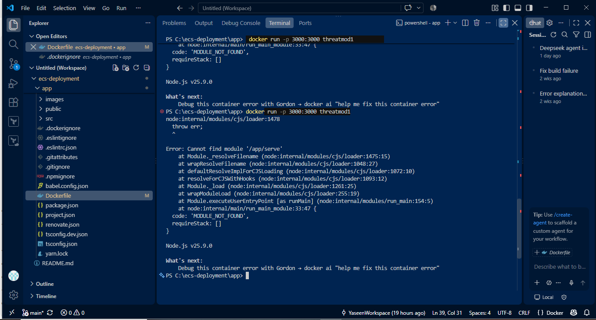

I added `chown` and `USER appuser` so the container wouldn't run as root, and it crashed on start.

**What actually happened:**
1. The `node` image has an entrypoint script. When the container starts, it checks whether the first word of `CMD` (`serve`) is a command it can find.
2. It **couldn't** find `serve`, so it assumed I meant a JavaScript file and ran `node serve`.
3. Node looked for a file called `/app/serve`, found nothing, and failed with `MODULE_NOT_FOUND`.

**Root cause:** `yarn global add serve` ran **after** `USER appuser`, so it installed `serve` into appuser's home folder, which isn't on the PATH. Run as root (before `USER`), it installs into a system folder every user can reach.

**Fix:** install `serve` first, then switch to the non-root user.

---

## 4. `Rpc error: EOF` and the 1.56 GB image

The build failed with `rpc error: code = Unavailable desc = error reading from server: EOF`.

**What happened:**
- `RUN chown -R appuser /app` had to change the owner of **every file** in `/app`. Because of `COPY --from=builder /app /app`, that included all of `node_modules`, tens of thousands of files. It took about **15 minutes**.
- Docker images are made of layers, and a layer can't modify an earlier one. So `chown` stores a **full new copy** of every file it touches, roughly doubling the image (1.56 GB).
- With old images and layers already piling up, Docker Desktop ran out of disk space and its engine crashed. `EOF` means the connection to the engine was cut off.

**Fix:** copy only the built files, not the whole app folder:

```dockerfile
COPY --from=builder /app/build /app/build
```

This took the image from **1.56 GB to 338 MB** (about 80% smaller).

**An even better option:** set the owner while copying. That avoids a separate `chown` layer altogether:

```dockerfile
COPY --chown=appuser --from=builder /app/build /app/build
```

---

## 5. The non-root Dockerfile

```dockerfile
FROM node:25-alpine AS builder
WORKDIR /app
COPY package.json yarn.lock ./
COPY . .
# Downloads everything into node_modules
RUN yarn install
# Compiles the app and outputs everything into /app/build
RUN yarn build

FROM node:25-alpine
WORKDIR /app
# Only the compiled files, to keep the runtime image small
COPY --from=builder /app/build /app/build
EXPOSE 3000
# serve is the web server that speaks HTTP. Installed as root so it's on the PATH.
RUN yarn global add serve
RUN adduser -S appuser
RUN chown -R appuser /app
USER appuser
CMD [ "serve", "-s", "build" ]
```

`adduser -S appuser` has to come before `chown` and `USER`, or the build fails with "unknown user".

**Website vs web server:**
- **Web server:** the software (here `serve`) that listens on a port, receives HTTP requests and sends back files.
- **Website:** the files it serves.

---

## 6. How a request reaches the container

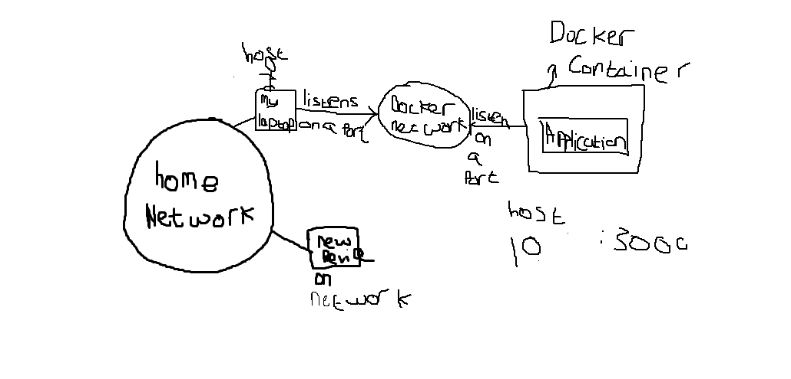

1. My browser sends a request to `localhost:3000`, on **my laptop**.
2. Docker's port mapping (`-p 3000:3000`) forwards it through Docker's virtual network to the container's own private IP (something like `172.17.0.2`), on port 3000.
3. `serve` inside the container answers, and the response goes back the same way.

The container's IP is private to Docker's network. Nothing on my home network can reach it directly, only through the port mapping.

---

## 7. ClickOps: deploying by hand in the AWS console

Before writing any Terraform, I built everything by hand to understand how the pieces fit together. This was done in **`us-east-1`**. The Terraform version later runs in **`eu-west-2`** (London).

### VPC

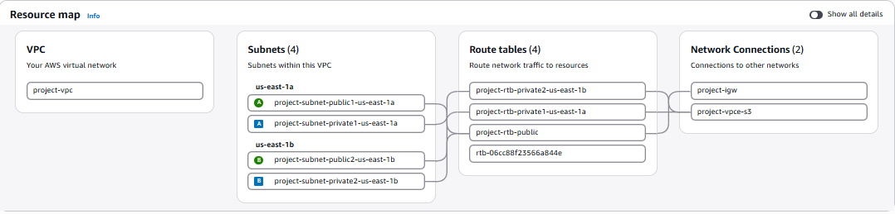

- **4 subnets:** public and private, in `us-east-1a` and `us-east-1b`
- **4 route tables**, and an **internet gateway** (`project-igw`)
- **`project-vpce-s3`**, an S3 *gateway endpoint*. ECR stores image layers in S3, so tasks in private subnets can download them through the endpoint without going out to the internet.

### 1. ECR repository

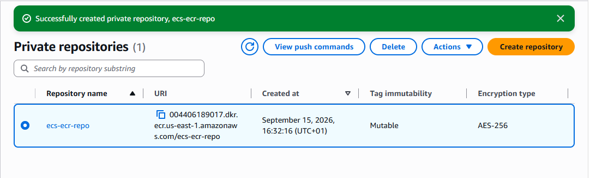

ECR stores the Docker image, and ECS pulls it from there when it starts a container.

**Why private, not public:** the image contains the application code and its configuration, so it shouldn't be downloadable by anyone on the internet. A private repository is the production-style choice.

### 2. ECS cluster

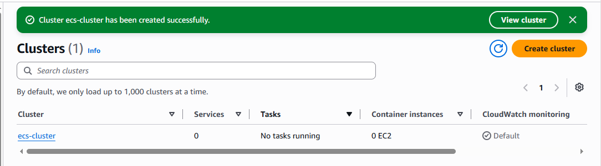

- **Misconception:** the cluster is the CPU and memory the app runs on.
- **Actually:** the cluster is a logical grouping where services and tasks are organised and managed. With **Fargate**, AWS supplies the machines for each task, which is why the cluster shows **0 EC2 container instances**.

### 3. Task definition

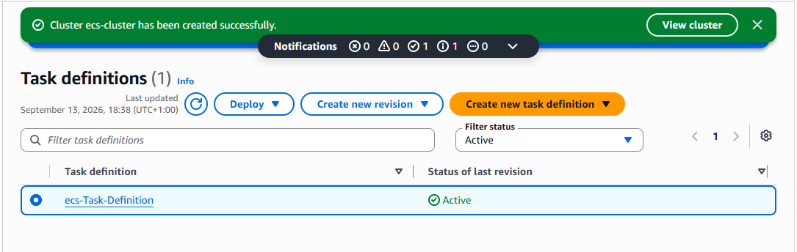

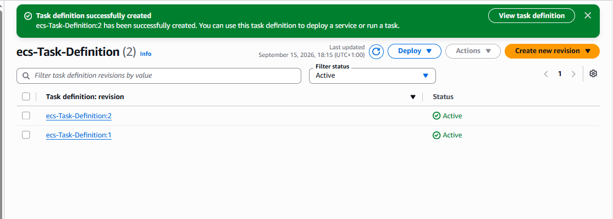

A task definition is the blueprint that tells ECS how to run the container: which image, how much CPU and memory, and which port to expose.

Task definitions **can't be edited**. Every change creates a new **revision** (`:1`, `:2`, …), and the service points to a specific one.

### 4. Application Load Balancer

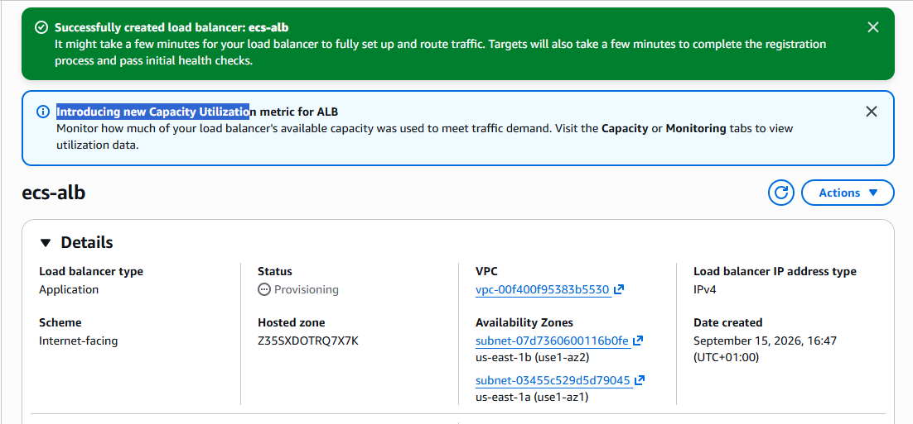

- Internet-facing, across two Availability Zones (`us-east-1a` and `us-east-1b`).
- **Hosted zone `Z35SXDOTRQ7X7K`** is the ALB's *own* zone ID, not my domain's. Route 53 alias records need it to point a domain at the ALB, which is why the Terraform ALB module outputs `alb_zone_id`.

### 5. Security group

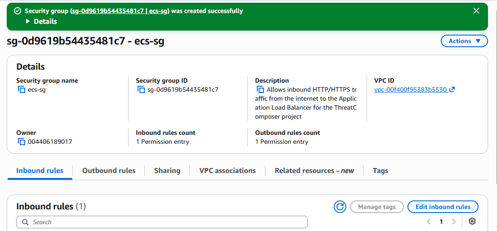

A security group controls **who can send traffic to a resource**, and **what that resource can send onward**. Everything is denied unless a rule allows it, like a door that only opens for people on the guest list.

**What happens without a rule for 443:**
1. The browser requests `https://tm.<domain>`.
2. Route 53 resolves the domain to the ALB's IP address.
3. The browser tries a TCP connection to the ALB on port 443.
4. The request reaches the ALB's network interface.
5. The ALB's security group has **no inbound rule for 443**.
6. The packet is **silently dropped**, and no reply is sent at all.
7. The browser waits and eventually **times out**.

That's why a security group problem looks like a timeout, not an error page.

**The full path:**
```
Browser ──HTTPS :443──► ALB ──HTTP :3000──► ECS task
```
The ALB talks to the task on the **container's port (3000)**, not 80.

**Best practice: two security groups.**
- The ALB's group allows 80/443 from the internet.
- The task's group allows port 3000 **only from the ALB's security group**.

### Steps 4 and 5 together: the ECS service

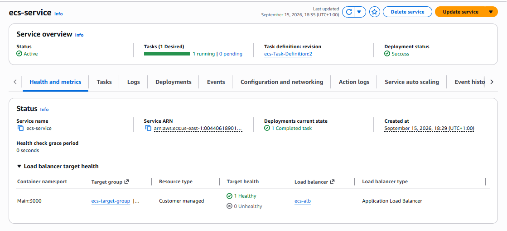

**Why did the service take so long to get working?** A task definition on its own doesn't run anything; it's only a blueprint. The **service** launches tasks from it and keeps them running. For a task to be **reachable**, four separate resources all have to agree:

| Resource | What it decides |
|---|---|
| Task definition | Which image, which port |
| Target group | Which port it sends to, which path it health-checks |
| ALB listener and rules | Where traffic is forwarded |
| Security groups | Who is allowed to talk to whom |

**Core lesson:** if any one of these four disagrees with the others, nothing works.

The screenshot shows it working: **1 running, 0 pending**, deployment **Success**, target **1 Healthy** on `Main:3000`.

**Health check grace period: 0 seconds** means the ALB starts health-checking new tasks straight away. A slow-starting app could fail its first checks and be restarted before it's ready.

### CloudWatch

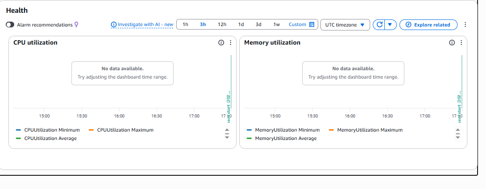

"No data available" was normal. ECS metrics only appear after the service has run for a few minutes, and per-task detail needs **Container Insights** turned on.

### 6. Point Route 53 at the ALB, and the listener rules

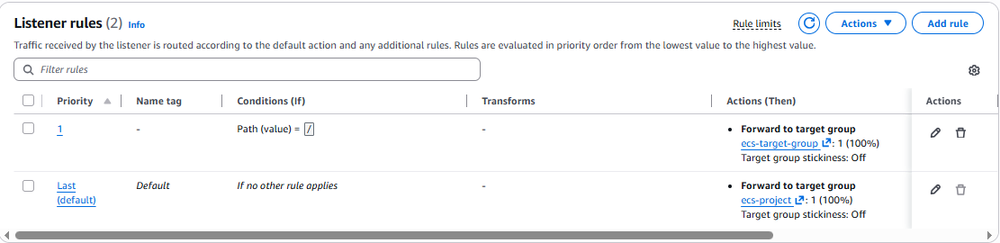

- **Rule 1:** path is `/` → forward to `ecs-target-group`
- **Default:** forward to `ecs-project`, a **different** target group

**This is a hidden bug.** A path condition of `/` matches **only** the exact path `/`. So `/health`, `/static/js/...` and every other path fell through to the default rule and went to `ecs-project`. If that target group had no healthy targets, those requests would fail even while the home page worked. The simple design is a single default rule forwarding to one target group, which is what the Terraform version does.

---

## 8. Debugging `https://tm.yaseenali.co.uk/health`

Each attempt got a little further. The error code shows how far the request got.

### Attempts 1–3: connection timeout

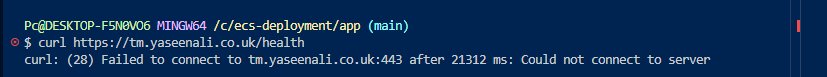
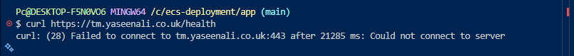
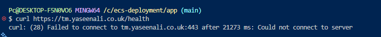

`curl: (28) Failed to connect ... port 443` means a **TCP timeout**: nothing answered on port 443. Either there was no HTTPS listener yet, or the security group didn't allow 443, in which case the traffic is dropped silently, as described in [section 7](#5-security-group).

At one point the task also failed with **`CannotPullContainerError`**: the task definition pointed at the wrong ECR repository or tag, so ECS couldn't download the image.

### Attempt 4: `504 Gateway Time-out`

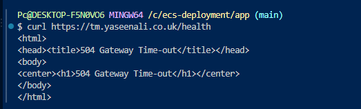

**504 is progress.** The request **reached the ALB**, but the ALB didn't get a reply from the task in time. The usual causes are:
- the task's security group doesn't allow port 3000 from the ALB, or
- the task is somewhere the ALB can't reach (see attempt 5).

### Attempt 5: `503 Service Temporarily Unavailable`

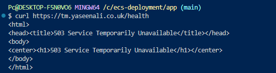

**503 means the ALB had no healthy targets** to send the request to.

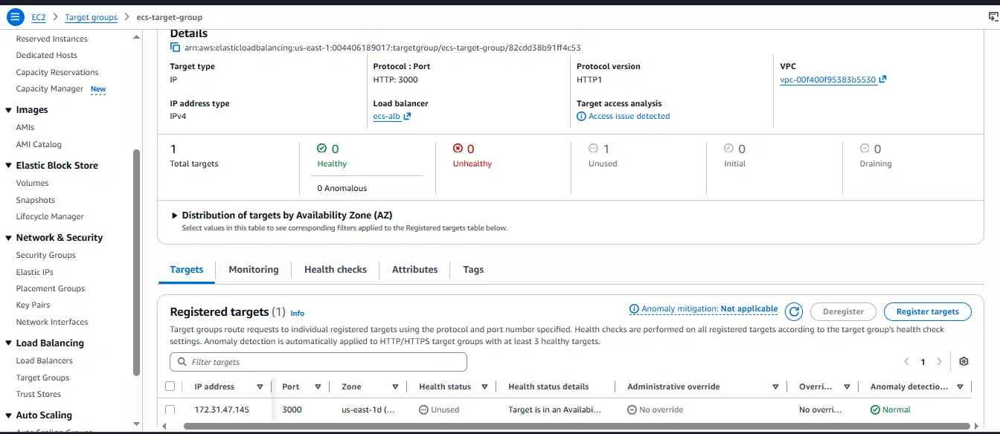

The target `172.31.47.145:3000` shows **Unused**: *"Target is in an Availability Zone that is not enabled for the load balancer."* The task had been placed in `us-east-1d`, but the ALB only covered `us-east-1a` and `us-east-1b`. The `172.31.x.x` address also shows it was running in the **default VPC's** subnets, not the project VPC, which explains the AZ mismatch.

**Option A: force a new deployment.** Fast and free, but it only works if the new task happens to land in a covered AZ. It hides the problem instead of fixing it, and it can happen again on any deployment.

**Option B: make the AZs match.** This fixes the root cause, so a task can never land where the ALB can't reach it. It's the production-grade approach.

**I chose Option B**, and added subnets in all four AZs to the ALB:

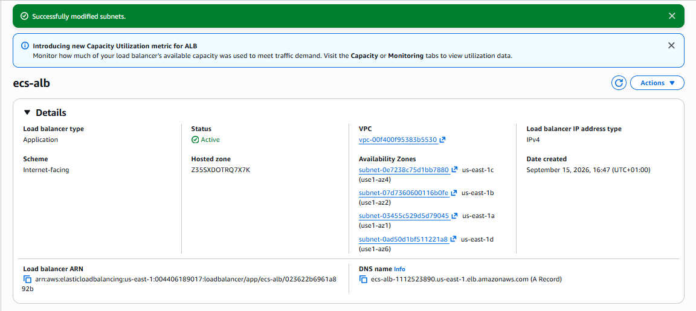

The more precise rule is that **the service's subnets and the ALB's AZs must match**: either run tasks only in AZs the ALB covers, or have the ALB cover every AZ the tasks can use.

> **Interview answer:** "The task and the load balancer disagreed on Availability Zones, so the target showed as *Unused* and the ALB returned 503. Instead of redeploying and hoping for a lucky placement, I aligned the ALB's subnets with the AZs the service could use. In Terraform, I pin the subnet AZs so it can't happen randomly."

---

## 9. `/health` returned the whole web page

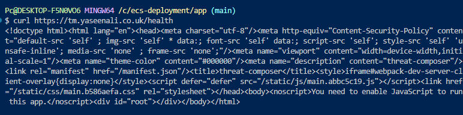

`curl https://tm.yaseenali.co.uk/health` returned the app's full `index.html` instead of `{"status":"ok"}`.

**Why:** `serve -s` runs in *single-page app* mode. It sends **every path** it doesn't recognise to `index.html`, so React can handle routing in the browser. `/health` was treated as one of the app's pages.

### Investigating

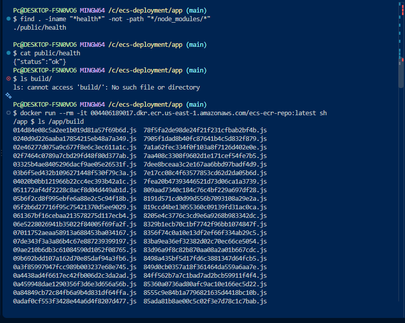

- `find` → `public/health` exists and contains `{"status":"ok"}` ✅
- `ls build/` → doesn't exist **on my laptop**. That's normal, because `build/` only exists **inside the image**.
- `docker run ... sh` then `ls /app/build` → the built files inside the image ✅

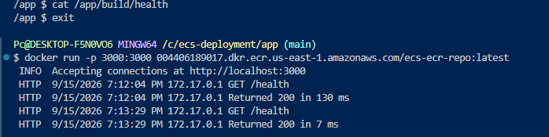

- `cat /app/build/health` printed **nothing**, so the health file wasn't in that image. It had been built before I added the file.
- `GET /health → Returned 200` looked like success, but `serve` was returning **`index.html`** with status 200, not the JSON. A 200 status alone doesn't prove the right content came back.

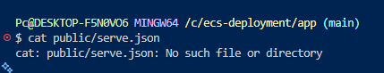

There was no `serve.json` to configure routes either.

**Why the fix didn't work, even later:** I tested adding both the `health` file and a `serve.json` rule. `serve -s` **still** returned `index.html`, because its "send everything to the app" rule runs **before** it checks whether a matching file exists.

**The fix:** serve the built app with **nginx** instead of `serve`. nginx's exact-match rule (`location = /health`) runs before the app fallback (see [section 12](#12-the-final-setup)).

---

## 10. Docker Desktop's engine stopped

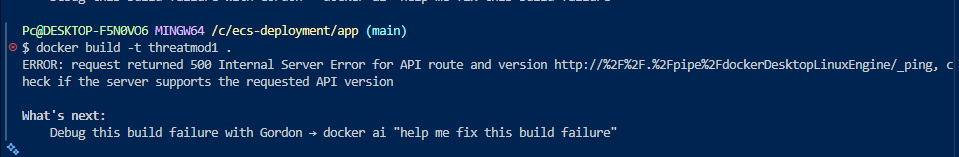

`request returned 500 Internal Server Error for API route ... dockerDesktopLinuxEngine/_ping`

The Docker command-line tool couldn't talk to the **Docker engine**, because Docker Desktop's engine had crashed or wasn't running, after the earlier disk-space problems. Restarting Docker Desktop fixes it, and `docker system prune` clears old images and build cache to free up space.

At this point I put the health check aside and moved on to Terraform.

---

## 11. Terraform

**Key terms:**
- **VPC (Virtual Private Cloud):** my own isolated network inside AWS.
- **Subnet:** a range of IP addresses inside the VPC, where resources are placed. *Public* subnets can reach the internet directly; *private* subnets can't.
- **Internet gateway:** connects the VPC to the internet, for the public subnets.
- **Route table:** the rules that say where traffic goes. Public subnets send `0.0.0.0/0` (everything) to the internet gateway. Private subnets send it to the **NAT gateway**, which lets them reach out without being reachable from the internet.

**CIDR size trade-off:** a range that's too small can run out of addresses as the project grows (more tasks, subnets, AZs), and a VPC's main range can't be resized later. A range that's too large can overlap with other networks, which blocks peering and VPNs. The aim is to size for realistic growth and plan ranges so they never overlap.

### How the files fit together

**Inside a module:**

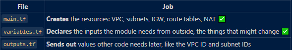

**In the root:**

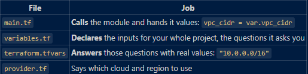

- `outputs.tf` **sends a value out of a module**, such as the VPC ID, so the root can pass it into other modules.

### Connecting modules

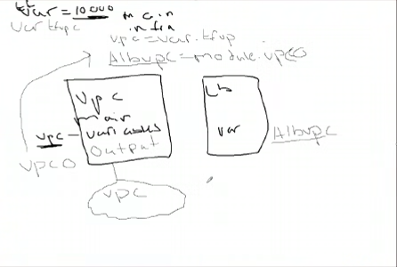

1. Create the resource inside a module, e.g. `aws_vpc` in the VPC module's `main.tf`.
2. Output its attribute in that module's `outputs.tf`:
   ```hcl
   output "vpc_id" {
     value = aws_vpc.ecs-vpc.id
   }
   ```
3. Declare a variable in the module that needs it, e.g. in the ALB module's `variables.tf`:
   ```hcl
   variable "vpc_id" {
     type = string
   }
   ```
4. Connect them in root `main.tf`: **`module.<module name>.<output name>`**:
   ```hcl
   module "alb" {
     source = "./modules/alb"
     vpc_id = module.vpc.vpc_id
   }
   ```
5. Use it inside the ALB module as `var.vpc_id`.

Modules can't see each other directly. Values always travel **module output → root → module variable**.

### The ALB needs two public subnets

An ALB has to be in public subnets in **two different Availability Zones**. If one AZ (a data centre) fails, it keeps serving from the other. My VPC only had one public subnet, so I added a second one in another AZ.

At one point I accidentally passed a **private** subnet to the ALB from root `main.tf`. An internet-facing ALB must sit in **public** subnets.

### Security groups are stateful

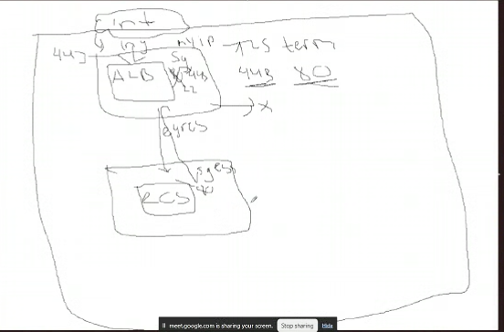

- **Stateful (security groups):** if a request is allowed in, the reply is automatically allowed back out.
- **Stateless (network ACLs):** traffic has to be explicitly allowed in **both** directions.

The sketch also shows **TLS termination**: the ALB decrypts HTTPS on port 443 using the ACM certificate, then talks to the ECS task over plain HTTP inside the VPC, on port 3000.

---

## 12. The final setup

What the project ended up with, after everything above:

**Container:** a multi-stage build, served by **unprivileged nginx** (runs as non-root user `nginx`, uid 101, on port 3000). The image is about **128 MB**.
```nginx
location = /health {
    default_type application/json;
    return 200 '{"status":"ok"}';
}
location / {
    try_files $uri $uri/ /index.html;
}
```
`/health` is matched exactly, **before** the app fallback, which fixes [section 9](#9-health-returned-the-whole-web-page).

**Terraform** (in `eu-west-2`), split into modules:
- **vpc:** VPC, 2 public subnets and 1 private, internet gateway, NAT gateway, route tables
- **alb:** ALB, security groups, target group, HTTPS listener, HTTP → HTTPS redirect
- **ecr:** image repository
- **ecs:** cluster, Fargate service, task definition, IAM role, task security group, CloudWatch logs
- **acm:** certificate with DNS validation, plus the Route 53 record for `tm.yaseenali.co.uk`
- **State** stored in S3, with locking

**Domain:** `yaseenali.co.uk` stays on Cloudflare, and only `tm.yaseenali.co.uk` is **delegated** to Route 53 with 4 NS records.

**CI/CD (GitHub Actions):**
- Logs in to AWS through **OIDC**, so no AWS keys are stored in GitHub
- **Build and Push:** builds the image, tags it with the commit SHA, pushes it to ECR
- **Terraform Deploy:** `fmt`, `validate`, `plan`, `apply`, then checks `https://tm.yaseenali.co.uk/health` for `{"status":"ok"}`
- **Terraform Destroy:** manual, tears down everything except ECR

**Result:** `https://tm.yaseenali.co.uk` serves the app over HTTPS, and `/health` returns `{"status":"ok"}`.
